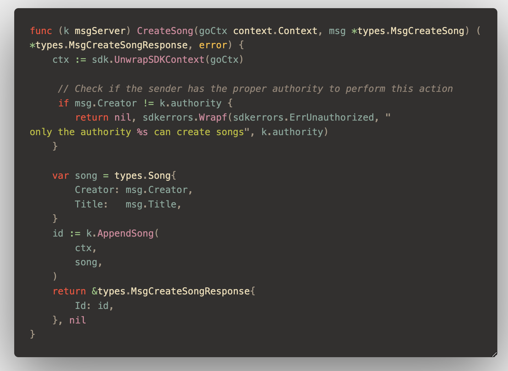

# music

**music** is a blockchain built using Cosmos SDK and Tendermint and created with [Ignite CLI](https://ignite.com/cli).

## Consensus Breaking change made


A consensus-breaking change in the context of blockchain refers to any modification in the blockchain protocol or logic that causes nodes (validators, full nodes, etc.) to no longer agree on the validity of the state or the transactions within the blockchain. In a decentralized system, all participating nodes need to follow the same set of rules to maintain a consistent view of the blockchain. If some nodes adopt a new set of rules that differs from others, it can lead to a split or divergence in the chain (a fork), where some nodes accept certain transactions and blocks as valid, while others reject them.

Implementing this check in your transaction logic will break consensus if I have previously allowed any user to create a song, and now I only allow a specific authority. This changes the rules of who can perform actions, which invalidates previously valid transactions.

Validators will no longer accept song creation transactions from users other than the authority. This means that any state (block or transaction) created under the old rule where everyone could create a song will now be incompatible with the new rule, and validators following the new rule will reject such transactions.

## Get started

```
ignite chain serve
```

`serve` command installs dependencies, builds, initializes, and starts your blockchain in development.

### Configure

Your blockchain in development can be configured with `config.yml`. To learn more, see the [Ignite CLI docs](https://docs.ignite.com).

### Web Frontend

Additionally, Ignite CLI offers both Vue and React options for frontend scaffolding:

For a Vue frontend, use: `ignite scaffold vue`
For a React frontend, use: `ignite scaffold react`
These commands can be run within your scaffolded blockchain project.

For more information see the [monorepo for Ignite front-end development](https://github.com/ignite/web).

## Release

To release a new version of your blockchain, create and push a new tag with `v` prefix. A new draft release with the configured targets will be created.

```
git tag v0.1
git push origin v0.1
```

After a draft release is created, make your final changes from the release page and publish it.

### Install

To install the latest version of your blockchain node's binary, execute the following command on your machine:

```
curl https://get.ignite.com/username/music@latest! | sudo bash
```

`username/music` should match the `username` and `repo_name` of the Github repository to which the source code was pushed. Learn more about [the install process](https://github.com/allinbits/starport-installer).

## Learn more

- [Ignite CLI](https://ignite.com/cli)
- [Tutorials](https://docs.ignite.com/guide)
- [Ignite CLI docs](https://docs.ignite.com)
- [Cosmos SDK docs](https://docs.cosmos.network)
- [Developer Chat](https://discord.gg/ignite)
